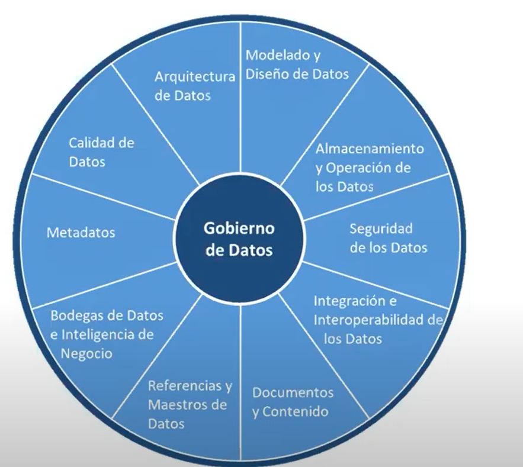
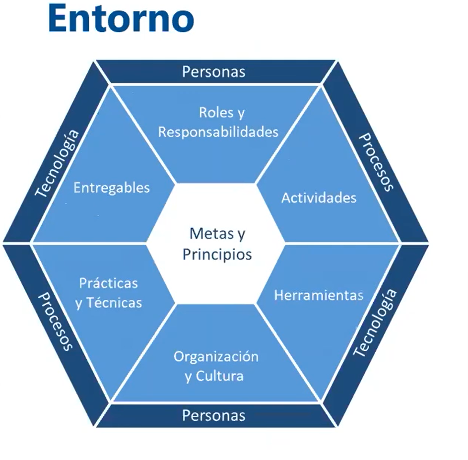

# **Gobernbanza de datos**

# Unidad 1 Introducción a la IA

## **Preludio. ¿Qué hay de nuevo viejo? (documento 1)   **

Aspectos básicos a entender para entender por qué hablamos de inteligencia artificial.

### **I. El coyote se convirtió en el correcaminos.**

La relación entre el hombre, las máquinas y la inteligencia se resumen en cuatro aspectos:

1. El desarrollo de la IA no consiste, al menos excusivamente, en imitar el funcionamiento de organismos biológicos. (ejemplo del pájaro y el avión)

2. Cuando analizamos resultados inteligentes en las máquinas, usualmente los naturalizamos. Si un sistema de algoritmos comienza a realizar ciertas actividades en las 
que iguala o mejora la capacidad de procesamiento de información de una persona, se suele afirmar que eso es una cuestión de computación o que no es una “verdadera inteligencia”.

3. Los algoritmos de ia existen gracias a la cantidad de datos que se generan y almacenan en esta era.

4. Actualmente las máquinas superan al hombre en muchos áras de la industria, los servicios y el comercio, gracias a que computadoras se ocupan de tareas que ase encontraban excusivamente en el ámbito de la inteligencia humana.

### **II ¿Qué hay de nuevo viejo?**

La inteligencia artificial es una nueva revolución de la escritura, montada sobre la electricidad, internet, algoritmos y computadoras. continuamos
recorriendo un camino que está signado por dos objetivos: esforzarnos para ahorrar esfuerzo y desarrollar simplificaciones que funcionan.

### **III Tortuga, chaparrón, Usain Bolt y Flash**

Crecimiento exponencial de de la tecnología.

## **El ABC de la Inteligencia humana**

### **A. Reconocimiento de patrones**

La inteligencia es estudiada como la capacidad de procesar la información para alcanzar objetivos. Existe un proceso muy complejo que quienes estudian el cerebro llaman "Reconocimiento de Patrones". Esto es, cómo el cerebro extrae, recorta, almacena y procesa la información proveniente del exterior a través de nuestros sentidos para lograr un objetivo o resolver un problema. 

### **B. Adaptación del cerebro humano**

Hay múltiples tipos de inteligencias. El que juega mejor a la ajedrez no necesariamete es la persona más inteligente. La inteligencia se mide en contexto a la capacidad de resolver un determiado problema en un determinado contexto.

Se ve el ejemplo de los sistemas de transporte. Cada uno está asociado a resolver un tipo de problemática. No es lógico usar un avión para ir a la esquina de nuestra casa. Esto nos dice que, no por ser el avión más sofisticado, es el mejor medio de transporte para todos los contextos.

La IA son un conjunto de tecnologías subyacentes con diferentes complejidades, y diferentes necesidades de entornos para funcionar. Por lo que su uso adecuado está relacionado al contexto en el cual será usada.

### **C. Límite de procesamiento de la información en personas humanas.**

La ai tiene un rol importante en cómo manejaremos los sesgos humanos en el futuro. El hombre por naturaleza tiene sesgos, la ai, puede profundizarlos o ayudarnos a encontrar salida a esos sesgos.

## **El ABC de la Inteligencia artificail**

### **A. Fenómeno del blanco movil**

A medida que la inteligencia artificial avanza, hay tecnologías que se naturalizan, y parecen quedar fuera de lo que se llama ia. A esto se le llama fenómeno del blanco movil.

### **B. Introducción a los datos, información, conocimiento y algoritmos (Documento 2)**

**I Introduccón**
Dos grandes ramas de la inteligencia artificial:
1. machine learning.
2. KR representación del conocimiento y razonamiento.

**II Las bases: datos, información, conocimiento y algoritmos**

Modelo del dominio; este término es muy conocido por su aplicación en muchas disciplinas e incluso la vida diaria, y hace referencia a un objeto (físico o no) que abstrae las propiedades interesantes para algún propósito de otro objeto para simplificar su estudio.

dato->dataset->información-> conocimiento-> algoritmos->crecimiento exponencial

**III Las múltiples caras de la inteligencia artificial**

No dice mucho más que la ia solo intenta imitar al humano

### **C. capacidad de reconocer patrones de información.**

##  **La “criatura nueva” del diario de Adán y Eva**

El desarrollador de un sistema inteligente diseña y entrena algoritmos que se orientan a construir agentes inteligentes o, en otras palabras, debe representar la información, construir la base de conocimiento, el razonamiento y el modo de aprendizaje para que el agente sea capaz de percibir el ambiente y ejecutar sus resultados. Así, alcanza su autonomía, ya que adquiere la capacidad de aprender a partir de su propia experiencia y se constituye en “inteligente”.

Sin embargo, el programador no ha desarrollado un algoritmo de solución del problema percibido, dado que esta es la razón de ser de la IA: actuar de manera no convencional a la programación tradicional.

ia fuerte e ia débil

definiciones de IA

**Conceptos e interpretaciones de lo que es la IA**

En su clásico libro de texto de conocido por las siglas de su título: “AIMA”) (77), Russell y Norvig proponen dos dimensiones: una de pensamiento vs. acción, y otra de racionalidad (78) vs. humanidad. Así, los autores catalogan cada uno de los cuatro cuadrantes de la siguiente manera, siendo los creadores del concepto de Agente Inteligente:

- Sistemas que actúan de forma humana

- Sistemas que piensan de forma humana o el abordaje del modelado cognitivo.

- Sistemas que piensan de manera racional o el abordaje según las “leyes del pensamiento”

- Sistemas que actúan de manera racional (agentes racionales)

**Dos ramas en busca de la realización de la inteligencia artificial**

- Inteligencia artificial basada en conocimiento.

Conocimiento: todo aquello que puede ser adscrito a un agente, tal que su comportamiento puede ser computado de acuerdo con el principio de la racionalidad. Ejemplo de las reglas que surgen del árbol genialógico.

Datos

## Motivaciones

Da ejemplos de aplicación de IA.

## Aplicaciones 

Divide en dos tipos:
- Sin personas en el proceso: 
    - Inteligencia asistida: Preparación de dictámenes judiciales Prometea
    - Inteligencia aumentada: google maps guia a conductor
- Sin intervención humana:
    - Automatización: chatbot 
    - Inteligencia autónoma: Testa, vhículos autónomos.

## Oportunidades de de la IA

Aumento de calidad eficiencia de productos

## Desafíos

Problemas éticos. ejemplo de ikea, choque de Tesla

Unesco define principios eticos:

R: human rights (derechos humanos). Violación de privacidad

O: openess (apertura). Tener conocimiento de como funciona para que no tenga sesgos 

A: acceso. Uso indevido de la información privada

M: gobernanza multipartita.  Marco legal que garantice protección de los derechos de los usuarios.

Podría uncrementarse la brecha  entre quienes se apresuran a adoptar estas tecnologías y quienes no y los trabajadores que se ajustan a la demanda de la en la era de la ia y los que no.

Es probables que los beneficios de la ia se distribuyan de manera desigual

El mal uso de la ia puede poner en riesgo los derechos escenciales de las personas.

## ¿Oportunidad o desafío?

Habla de que en el futuro la ia autoconciente puede ser una amenza en base a una charla en la que participaron elonk musk y zukerberg

## Acciones. Usos de la IA para servicios públicos.

En muchos paises europeos usan ia para mejora en los servicios públicos.
Hay estrategias nacionales de ia. Énfasis en las capacidades humanas.

Observatorios de políticas de ia

## Estado del arte (Documento 4)

No dce mucho. Habla sobre los diferentes actores sociales que están apostando al futuro de la ia.

## Gobernanza y estado de la inteligencia artificial en América Latina (documento 5)

Habla de los modelos de gobernanza de la ia adoptados por diferentes paises de latinoamérica

Habla la necesidad de que participen los diferentes sectores de la sociedad, de la colaboración internacional y de la constante revisión basada en evidencia.

Habla también de tener políticas destinadas a generar el capital humano necesario para poder llevar adelante la transformación de la ia.

Durante el sumMIT sedestacaron tres aspectos para el diseño de políticas de ia:
- políticas que responsabilidad social y ética en ia
- que las políticas se definan a través de un pensamiento colectivo, inclusivo e interdisiplinario
- contar con guías éticas razonablemente establecidas.

se consideró que la educación en inteligencia
artificial es el principal reto que deberán abordar los países latinoamericanos en los siguientes años.

Se habla de la capacitación en ia de la población y de la formación general en todos los niveles de formación. Hace falta sinergia entre universidades, industrias, gobiernos y paises de la región para darle el lugar necesario para estar a la altura.

Para resolver los problemas de la región hay que esperar que las respuestas surgan de la misma región y no provengan de las soluciones aplicadas en el extranjero .

Habla del trade off respecto a la pérdida de empleo y a la generación de nuevos roles. 

Los datos constituyen el insumo básico de la ia. Esto genera el planteo de los problemas y desafíos asociados a los datos. Uno es generar cultura de obtención de datos de una manera sistemática y organizada. Se habla de no perder el foco en ética y derechos humanos.

Por ejemplo, se recomienda: incubar, diseñar, desarrollar o contratar sistemas de IA aplicables en el sector público, siempre que sean: i) trazables; ii) explicables; iii) transparentes; iv) auditables; e v) interoperables, bajo un enfoque de “caja blanca” en donde la decisión sea razonada y fundada, y el “paso a paso” pueda ser determinado con precisión.

## Impacto de la ia en temáticas de radical importancia para la región (documento 6)

### Inteligencia artificial y educación

### Inteligencia Artificial + Estado, Administración y Justicia

## Concluciones sobre oportunidades y desafíos de la IA para la región.

## Impacto de la ia en el trabajo (documento 8)

Primero hace una comparación con el surgimiento de la imprenta y de cómo generó desigualdad.

Luego habla de tres grandes tendencias vinculadas al impacto de la inteligencia artificial:
1. Los trabajos no están en riesgo en el corto plazo y no hay certeza de lo que sucederá a largo plazo.
2. Hay pocas publicaciones respecto a los nuevos trabajos que están surgiendo.
3. EL desafío es automatizar para humanizar, reconvertir las fuentes de trabajos rutinarias o insalubres y fomentar el desarrollo de nuevas habilidades.

Luego habla de lo mismo. Reemplazo de trabajos rutinarios, las oportunidades que genera la ia para los paises en desarrollo y de la transición a las nuevas habilidades.

## ¿Las máquinas nos desemplean? (Documento 9)

Primero habla de tres efectos que suceden en el proceso de automatización en las empresas. 1 el desplazamiento donde un trabajo es desplazado por otro, 2 la complementaridad, donde aparecen nuevos puestos asociados a nuevas tareas y 3 la productividad, que su aumento devido a la producción se plasma en una baja de precios (no está muy claro este último). 

### perspectivas en latinoamérica.

Habla de que las diferencias en infraestructura respecto a los paises desarrollados no permite una visión clara de cómo impactará la automatización. Pero propone tomar las ventajas que esta trae teniendo en cuenta 1 la capacitación de los trabajadores en estado de vulnerabilidad para que la transición sea inclusiva. 2 Se dan muchos ejemplos de uso de automatización e ia exitosos y de impacto y luego plantea del trade off entre tener más productividad con humanización de empleo y averiguar cuáles son las nuevas tareas asociadas a la automatización.

## Los trabajos y tareas que surgen en la era de la ia (documento 10)

Se basan en cuatro aspectos:
1. trabajos centrados en el uso y mejora de la tecnología: 
2. los freelance que se desarrollan en la economía colaborativa: trabajos por proyecto en un área específica, efímero
3. los empleos que surgen de las redes sociales
4. economía naranja, asociado al crecimiento de las actividades vinculadas a la creatividad, el arte y el entretenimiento.

## Acelerar la reconverción y proteger a las personas vulnerables.

Debemos ocuparnos de fortalecer e impulsar siete grandes factores para acelerar la reconverción y proteger a las personas vulnerables

1. La transición trae aparejada un trabajo extra de implementación y la aparición de tiempo para ocuparse de nuevos problemas que no 
2. es clave diferenciar trabajos y tareas, para dividirlas en tres grandes mundos: automatizables, no automatizables y semiautomatizables.
3. todo lo que surge de forma indirecta, no prevista, cuánto impacta a nivel global, cómo se reconvierten las personas que se dedican a esas tareas, y cuánto tardan las innovaciones en avanzar.
4. Existe una gran brecha entre los que pueden desarrollar IA, los que están capacitados para entenderla, acompañar el proceso, y los altos costos que puede suponer escalar sistemas en los que en la mayoría de los casos existen entornos de small data. 
5. Poner los sistemas en función de los humanos, automatizando lo automatizable, reduciendo cliks y cantidad de ventanas a abrir para realizar un procedimiento.
6. el crecimiento exponencial de ciertas tecnologías abre puertas impensadas e indirectas.
7. muchos nuevos trabajos no requieren adaptación ni formación académica. Por ejemplo, si tiene auto y licencia, puede ser chofer de
Uber en Mendoza.

## Paradojas tecnologicas de la historia. Como aprovecharlas para enfocar la IA de manera sostenible

Empieza hablando de que tecnologías viejas pueden ser más rápidas que las nuevas, da un ejemplo del telégrafo vs sms. Otro ejemplo más representativo es que hoy en día en las ciudades es más rápido la bicicleta que los automóviles ya que la innovación no encuadra dentro de un modelo sostenible.

### El cantante sin voz

Habla de cómo la industria de la música no evolucionó de manera lineal, y que era muy dificil de predicir el modelo de negocio que actualmente existe. Habla de la transición del cd al straming y de cómo se reditribuyen las ganancias y como la ia juega un papel importante hoy en la defensa de los derechos de autor.

### Motzar, Salieri y la ia

Muy lindo pero no se entiende a qué quiere llegar.

# Unidad 2  Introducción a la gobernanza de datos

## Cómo hacer un buen gobierno de datos.

Habla de dos paradigmas, el de la academia y el de la industria. El de la academia como punto de partida y el de la industra el que genera conocimiento práctico más útil, ya que permite la maduración.

Valor de los datos. Es el reto de la política del gobierno de datos.

Habla de los metadatos, y de la gran relevancia de esto para gestionar datos. Es el diccionario de qué es un dato y para qué se utiliza dentro de la organización, y qué valor tiene.

Asociación de gestión de los datos.
Define que hay gobierno de datos si tengo un marco de gestión, en donde hay un conjunto de categorías en las que los datos están enmarcados.

Entorno propuesto por esta organización

## BLACK MIRROR “Bandersnatch” y organizaciones 4.0

Habla de los árboles de decisión y su aplicación a la burocracia.

## Trabajos vs Tareas (Documentos 1)

En general, los oficios y las profesiones que desarrollan las personas están conformados por múltiples y diversas tareas, que a su vez
requieren distinciones en relación a las capacidades cognitivas que hay detrás de cada una. Pero, además, el desarrollo de la inteligencia Artificial y de la robótica depende en gran medida del tipo de tarea que se realice y de cómo se interconecta con otras. Aquí podemos hablar de grados de automatización.

Entre diversos obstáculos, hay dos factores clave para entender las razones por las cuales los sistemas de IA no avanzarán tan rápido sobre las actividades o tareas que integran trabajos o empleos con significativa carga burocrática. 

Una es la imposibilidad de que los datos se encuentren organizados y disponibles digitalmente.

La otra es la necesidad de etiquetado de datos generados para que los expertos en ia puedan entrenar los modelos.

los sistemas más exitosos de Inteligencia Artificial requieren muchas personas, para que junto a la inteligencia humana, logren mejorar todo lo que rodea a una o varias actividades concretas. A este fenómeno se lo llama “paradigma de inteligencia híbrida”, que resulta de combinar inteligencia humana más inteligencia artificial.

## Instructivo de gobrernanza de datos. (Documento 2)

### Paso a paso de los procesos de gobernanza de datos

