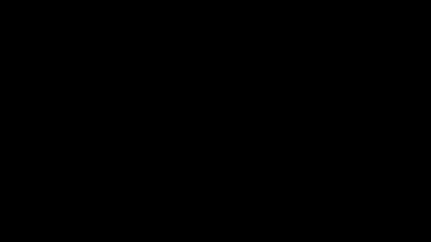
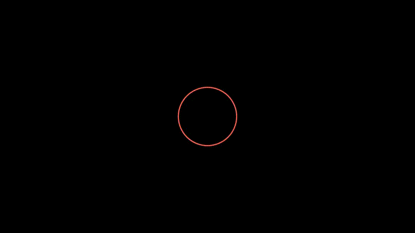
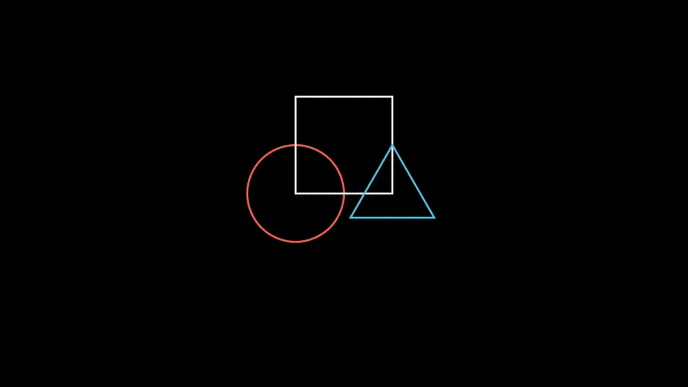
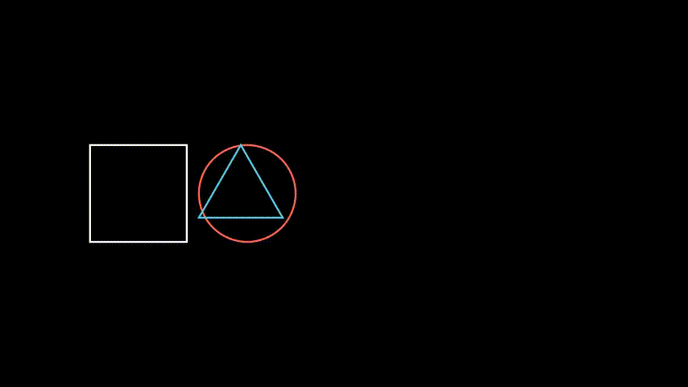
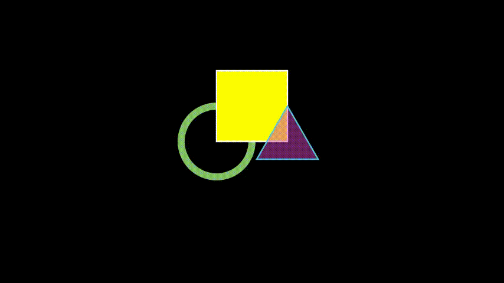
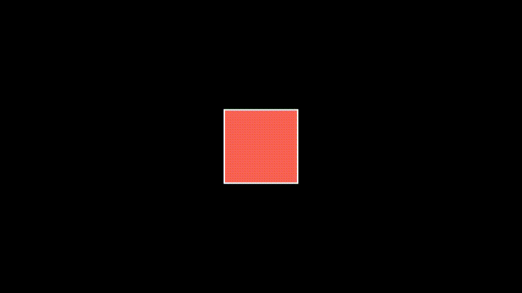

# Manim

Apuntes que tomo de distintos sitios para aprender a usar la librería de Python Manim.

Para instalar seguir los [estos pasos](https://docs.manim.community/en/latest/installation.html)

Para utilizar la biblioteca Manim y por ende entender estos apuntes se deberá tener conocimientos del lenguaje de programación Python y del paradigma de Programación Orientado a Objetos (POO)

**Primer ejemplo** (más adelante se dará una descripción detallada de cómo funciona):

Supongamos el siguiente código de Python y guardado en un archivo llamado escena.py:

~~~py
from manim import *

class SquareToCircle(Scene):
    def construct(self):
        circle = Circle()                    # Crea un círculo
        circle.set_fill(PINK, opacity=0.5)   # configura color y transparencia

        square = Square()                    # Crea un cuadrado
        square.flip(RIGHT)                   # lo espeja horizontalmente
        square.rotate(-3 * TAU / 8)           # Lo rota un determinado ángulo

        self.play(Create(square))      # anima la creación de un cuadrado
        self.play(Transform(square, circle)) # interpola el cuadrado hacia un círculo
        self.play(FadeOut(square))           # realiza un "fade out" de la animación
~~~

A partir de este código se puede crear un render de la clase SquareToCircle (nombre elegido por el programador). Render es el proceso por el cual el código se convertirá en un video. Esto se realiza al ejecutar el siguiente comando en consola:

~~~console
$ manim escena.py SquareToCircle -pql
~~~

Y como resultado obtendremos la siguiente animación:

El parámetro ``-p `` provoca que se reproduzcael video resultante de la escena al finalizar de ser renderizada. Si en vez de reproducir el archivo queremos que abra el directorio que contiene el video usamos el parámetro ``-f``

El parámetro ``-ql`` indica low quality (480p). Alternativamente se pueden utilizar los parámetros ``-qm`` (720p) ``-qh`` (1080p) ``-qk``(4k).

Manim genera por defecto archivos ``.mp4``. Si deseamos generar un archivo ``.gif`` usamos el parámetro ``-i``.

Para renderizar todas las escenas de un .py se utiliza el parámetro ``-a``.

## Bloques de construcción de Manim

Existen tres diferentes conceptos que se pueden orquestar juntos para producir animaciones matemáticas. El objeto matemático llamado ``mobject``, la animación y la escena. Cada uno de estos conceptos es una clase de python separada.

### Mobject

Es el bloque base de construcción de animaciones. Representa un objeto que puede ser mostrado en la pantalla como círculos, flechas, rectángulos y otros ejemplos más complicados como ejes cartesianos, funciones de graficación y gráficos de barra.

Existe una clase deribada de mobject llamada VMobject la cual usa ``graficos vectoriales``, que es la tecnología utilizada para representar figuras a través de vectores. Un ejemplo de software que trabaja principalmente con esta tecnología es Adobe Ilustrator. 

Usualmente todo el código de un script que usa manim para realizar animaciones se encuentra dentro de un método llamado ``construct()`` que a su vez se encuentra dentro de una clase que hereda de ``Scene``. Para mostrar un mobject en la pantalla llamamos al método ``add()`` de la escena. Esta es la manera de mostrar en pantalla un mobject cuando este no es animado. Para remover un mobject de la pantalla, llamamos al método ``remove()``.

Ejemplo de código:
~~~py
class CreatingMobjects(Scene):
    def construct(self):
        circle = Circle() # Se crea un mobject (círculo) 
        self.add(circle) # Se agrega a la pantalla
        self.wait(1) # Se muestra por un segundo
        self.remove(circle) # Se remueve
        self.wait(1) # Se muestra la pantalla vacía por un segundo
~~~

La lista completa de mobjects predefinidos se puede encontrar [aquí](https://docs.manim.community/en/latest/reference.html). Cabe aclarar que es posible crear mobjects personalizados.

### Cómo ubicar mobjects en la pantalla.

Por defecto los mobjects son colocados en el centro de la pantalla que es definido como el origen de coordenadas. Para ubicar los mobjects en diferentes posición de la pantalla se pueden utilizar diferentes métodos que provee la clase mobject.

Por ejemplo, se puede usar el método ``shift()`` para indicar la posición en la que se ubicará una figuras en la pantalla. Para esto el método recibe los argumentos ``UP``, ``DOWN``, ``RIGHT`` y ``LEFT``.

Ejemplo:

~~~py
class Shapes(Scene):
    def construct(self):
        circle = Circle()
        square = Square()
        triangle = Triangle()

        circle.shift(LEFT)
        square.shift(UP)
        triangle.shift(RIGHT)

        self.add(circle, square, triangle)
        self.wait(1)
~~~

Otros métodos para definir la posición de los mobjects en la pantalla son ``move_to()``, ``next_to()``, y ``align_to()``

~~~py
class MobjectPlacement(Scene):
    def construct(self):
        circle = Circle()
        square = Square() # podríamos haber ejecutado square.shift(LEFT) por ejemplo y ya se crea ubicado a la izquierda.
        triangle = Triangle()

        # Coloca el círculo dos unidades a la izquierda del origen
        circle.move_to(LEFT * 2)
        # Coloca el cuadrado a la izquierda del círculo
        square.next_to(circle, LEFT)
        # Alinea el borde izquierdo del triángulo con el borde izquierdo del círculo
        triangle.align_to(circle, LEFT)

        self.add(circle, square, triangle)
        self.wait(1)
~~~

### Cómo agregar estilo a los mobjects

Los métodos más básicos para agregar estilos que poseen los mobjects son ``set_stroke()`` para configurar el estilo del borde y ``set_fill()`` para configurar el estilo del relleno.

~~~py
class MobjectStyling(Scene):
    def construct(self):
        circle = Circle().shift(LEFT)
        square = Square().shift(UP)
        triangle = Triangle().shift(RIGHT)

        circle.set_stroke(color=GREEN, width=20)
        square.set_fill(YELLOW, opacity=1.0)
        triangle.set_fill(PINK, opacity=0.5)

        self.add(circle, square, triangle)
        self.wait(1)
~~~

Cuando utilizamos el método add() tenemos que tener en cuenta el orden en el que le entregamos los mobjects ya que este orden (de izquierda a derecha) representa el orden de aparición en pantalla. De esta manera sabremos que objeto aparecerá "encima" de otro.

### Animaciones.

Generalmente se agrega animaciones a una escena con el método play().

Las animaciones son procedimientos que realizan una interpolación entre dos mobjects. Por ejemplo. el método FadeIn(square) comienza con una con una versión totalmente transparente del cuadrado y la interpola gradualmente a una versión totalmente sólida (sin transparencia).

~~~py
class SomeAnimations(Scene):
    def construct(self):
        square = Square()
        self.add(square)

        # some animations display mobjects, ...
        self.play(FadeIn(square))

        # ... some move or rotate mobjects around...
        self.play(Rotate(square, PI/4))

        # some animations remove mobjects from the screen
        self.play(FadeOut(square))

        self.wait(1)
~~~

Si una propiedad de un mobject puede ser modificada, entonces se puede realizar una animación de esa propiedad. De hecho, cualquier método que cambia una propiedad de un mobject puede ser usada para una animación a través del uso de ``ApplyMethod``.

~~~py
class ApplyMethodExample(Scene):
    def construct(self):
        square = Square().set_fill(RED, opacity=1.0)
        self.add(square)

        # animate the change of color
        self.play(ApplyMethod(square.set_fill, WHITE))
        self.wait(1)

        # animate the change of position
        self.play(ApplyMethod(square.shift, UP))
        self.wait(1)
~~~

